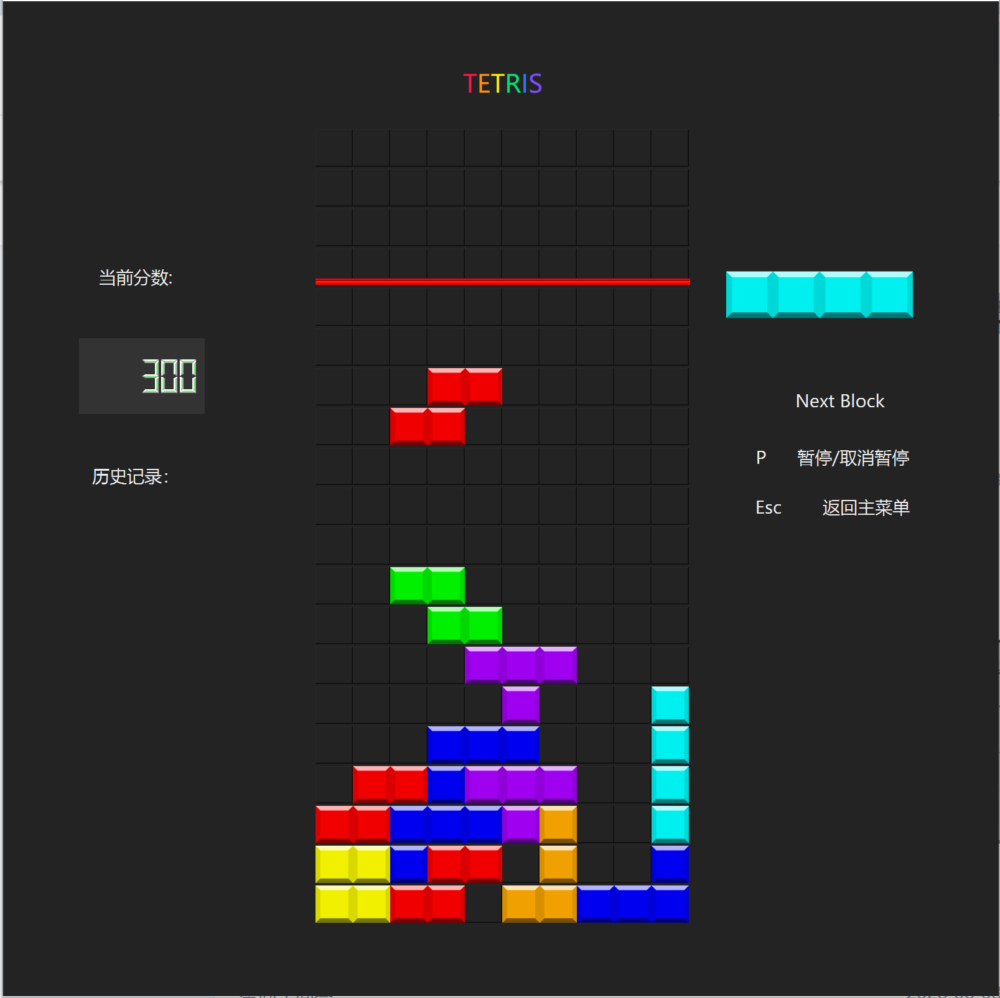
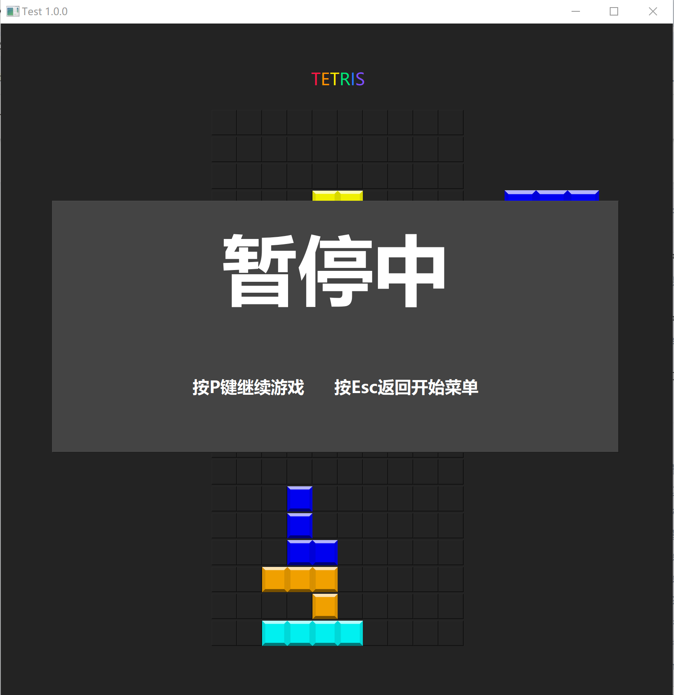
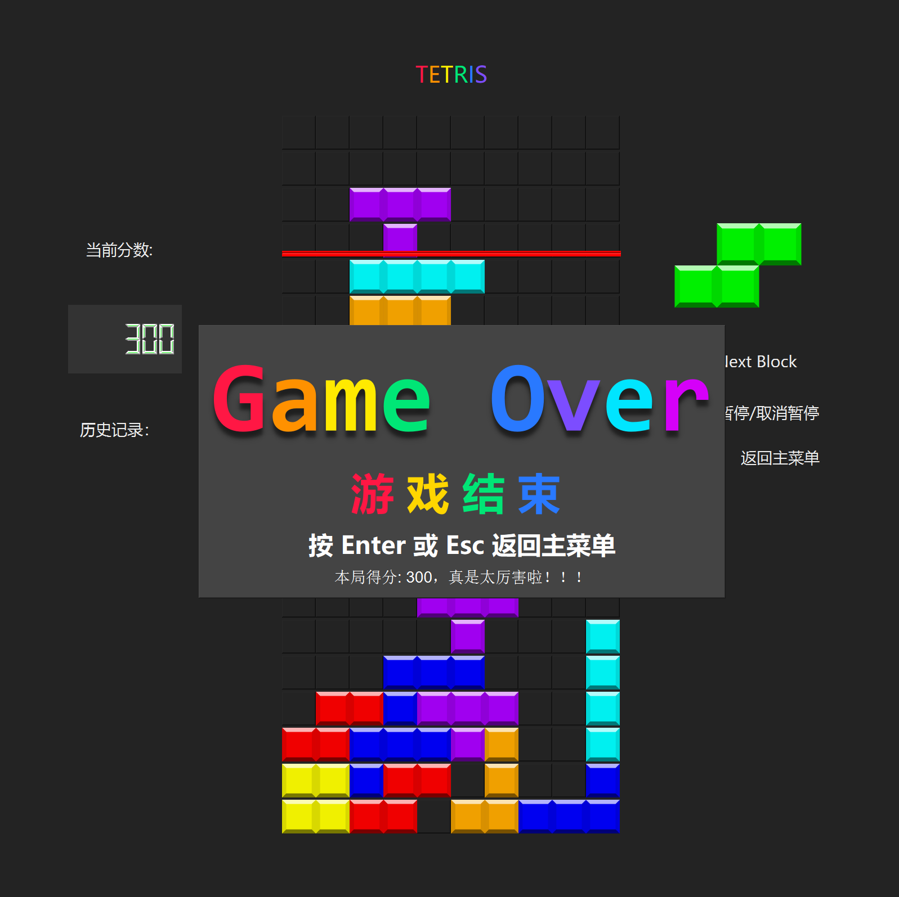

# 俄罗斯方块图形化概要设计书

## 1\. 引言

### 1.1. 文档目的

本文档旨在对基于C++和Qt框架开发的图形化俄罗斯方块游戏项目进行全面而深入的概要设计说明。

### 1.2. 项目范围

该项目是一款功能完备的桌面端俄罗斯方块游戏。其核心功能包括：

  * 完整的俄罗斯方块游戏逻辑，包括方块的随机生成、下落、移动、旋转。
  * 图形化的用户界面(UI)，实时渲染游戏棋盘、得分、下一个方块预览等。
  * 响应式的用户键盘输入控制。
  * 完善的游戏状态管理，覆盖主菜单、游戏进行、暂停、游戏结束等多种状态。
  * 本地化的数据持久化，用于记录玩家的历史最高分。

### 2\. 用户界面设计

本俄罗斯方块游戏采用现代简洁的界面布局，深色背景突出游戏内容，提升玩家视觉体验。界面设计要素详述如下：

### 2.1 总体设计风格说明
深色主题突出彩色方块，降低视觉疲劳，提升专注度。
彩虹色大标题和丰富颜色增强界面活力。
操作提示直观清晰，用户易于上手。
样式风格保持统一，保证良好美感和一致性。

### 2.2 开始菜单界面
初始状态显示“TETRIS”大标题及“俄罗斯方块”副标题。
提示“按下Enter以开始游戏”。
详细列出控制键说明：“←→ 或 A/D 左右移动”，“↑ 旋转”，“↓/Space 立刻下落”。
效果示例：

### 2.3 游戏界面
游戏标题：界面顶部中央用彩色字体显示“TETRIS”，突出游戏品牌感。
游戏棋盘：正中央为主要操作区，方块以不同颜色显示。
分数显示：左侧区域有“当前分数”和“历史记录”，采用数码管风格字体，提升科技感。
下一个方块预览：棋盘右侧，实时显示下一个将要出现的俄罗斯方块。
操作提示：右侧清晰列出操作说明（如“P 暂停/取消暂停”、“Esc 返回主菜单”）。
整体布局：信息分区明确，操作直观，便于玩家快速上手。
效果示例：

### 2.4 游戏暂停界面
游戏暂停时在中央弹出半透明遮罩。
显示大号“暂停中”字样，下方有明确恢复/返回提示（“按P键继续游戏”、“按Esc返回开始菜单”）。
背景棋盘和方块依然可见，不过逻辑暂停。
效果示例：

### 2.5 游戏结束界面
游戏终止时中央弹出深色提示框。
用彩色大字显示“Game Over”与中文“游戏结束”。
提示可按Enter或Esc返回主菜单，并显示本局得分及鼓励语句（如“本局得分：300，真是太厉害啦！！！”）。
效果示例：

## 3\. 自动机模型（状态转换图）
本项目的俄罗斯方块游戏严格按照状态机模型组织整体流程，确保各界面及操作间转移清晰、稳定，便于维护和扩展。

stateDiagram-v2
    [*] --> MAIN_MENU : 启动时

    MAIN_MENU --> PLAYING : 按 Enter 开始游戏

    PLAYING --> PAUSE : 按 P 暂停
    PAUSE --> PLAYING : 按 P 继续

    PLAYING --> GAME_OVER : 方块堆叠超过死亡高度

    GAME_OVER --> MAIN_MENU : 按 Enter 或 Esc 返回菜单

    PLAYING --> MAIN_MENU : 按 Esc 返回菜单
    PAUSE --> MAIN_MENU : 按 Esc 返回菜单
    GAME_OVER --> [*] : 点击右上角叉关闭窗口或结束进程

    %% （游戏界面内，用户通过 ↑↓←→ 或 WSAD 控制方块）

### 3.1 状态划分
游戏核心状态可分为以下几类：

 * 开始菜单界面 (MAIN_MENU)：游戏启动后默认进入，玩家可浏览 title 与操作说明，静候输入。
 * 游戏进行中 (PLAYING)：进入游戏界面，玩家通过“上下左右键（WSAD）”操作方块，分数实时刷新。
 * 暂停界面 (PAUSE)：游戏中按下 P 键可随时切换到暂停界面，所有动作冻结，显示继续/返回提示。
 * 游戏结束界面 (GAME_OVER)：若方块堆叠超过最大高度，立即进入“游戏结束”界面，展示得分及返回选项。
### 3.2 状态转移关系
 * 主菜单界面 → 游戏进行中
  玩家按 Enter 键，正式开始游戏，进入游戏界面。
 * 游戏进行中 ↔ 暂停界面
 按 P 键可在“游戏界面”与“暂停界面”间切换。暂停时，所有方块运动停止，界面冻结；再次按 P 可恢复游戏。
 * 游戏进行中 → 游戏结束界面
  游戏进行过程中，当方块堆叠超出死亡高度时，自动转入“游戏结束”界面，并锁定操作。
 * 游戏进行中/暂停界面 → 主菜单界面
  在“游戏界面”或“暂停界面”任意时刻可按 Esc 返回主菜单，当前进度丢失。
 * 游戏结束界面 → 主菜单界面
  游戏结束后，按 Enter 或 Esc 均可回到主菜单，准备新一局挑战。
 * 任意界面 → 程序终止
  用户可随时点击窗口右上角“关闭”按钮强制结束进程，程序退出。
### 3.3 状态机模型特点
流程单一、状态切换明晰，无多余嵌套，便于后续增加如“设置”、“高级排行榜”等附加功能。
状态间切换全部由显式的用户输入触发，防止误操作。
暂停、菜单、游戏结束等状态均用弹窗遮蔽棋盘，确保交互专注、界面规

## 2\. 系统架构

本游戏采用了一种典型的面向对象的组件化设计，其结构可以看作是**模型-视图-控制器 (MVC)** 模式的变体。

  * **模型 (Model)**: 主要由 `Game` 类、`Block` 类和 `Pos` 等数据结构组成。`Game` 类封装了游戏的所有核心规则、数据（如棋盘 `game_board`）和逻辑，独立于任何UI展示。
  * **视图 (View)**: 由 `MainWindow` 类及其关联的UI文件 (`ui_MainWindow.h`) 构成。它负责将模型中的数据以图形化的方式呈现给用户。`cell_drawing.cpp` 中的函数专门负责将游戏棋盘数据渲染到UI组件上。
  * **控制器 (Controller)**: 主要体现在 `MainWindow` 类的事件处理部分 (`control.cpp`) 和游戏循环逻辑 (`loop.cpp`) 中。它接收用户的输入（键盘事件），并调用模型的方法来更新游戏状态，同时通知视图刷新显示。

此外，引入了 `Context` 类作为**状态管理器**，它持有模型 (`Game`) 和游戏整体状态 (`Status`) 的实例，在控制器和模型之间起到了重要的协调作用。

### 4.1. 架构流程图

以下流程图直观地展示了游戏的核心逻辑流程，特别是玩家的一次操作（如移动、旋转）在系统内部的实现。

**图解**:

1.  **用户输入 (Action)**: 玩家通过键盘输入一个动作（左移、右移、旋转、下落）。
2.  **控制器处理**: `MainWindow::keyPressEvent` 接收到事件，并调用 `Game` 类中对应的尝试移动方法（如 `tryMoveLeft`）。
3.  **模型更新**: `Game` 类检查该移动是否有效 (`isValidAction`)。如果有效，则更新 `current_action` 中的方块位置 (`anchor`)。
4.  **视图同步**: 控制器调用 `syncBoardAndActionToUi`，该函数会清空旧位置的方块，并在新位置重新绘制，从而完成视图的更新。

## 5\. 核心模块详解

### 5.1. 主窗口与应用入口 (`MainWindow`, `main.cpp`)

作为应用的核心，`MainWindow` 类承担了视图和控制器的双重职责。

  * **入口点**: `main.cpp` 是程序的入口，它创建了 `QApplication` 和 `MainWindow` 的实例，并启动了Qt的事件循环。
  * **UI初始化**: `MainWindow` 的构造函数负责初始化UI组件、设置窗口样式（如深色模式）、连接信号与槽（特别是 `QTimer` 的 `timeout` 信号到 `onTimeOut` 槽函数），并隐藏初始状态下不需要的菜单（如游戏结束菜单和暂停菜单）。
  * **渲染管理**: 包含了一系列UI渲染函数（大部分实现在 `cell_drawing.cpp`），如：
      * `setCellColor`: 设置棋盘上单个单元格的颜色或图片。
      * `setNextBlockWidget`: 更新“下一个方块”预览区的显示。
      * `setScoreWidgetNumber`: 更新分数显示。
      * `syncBoardAndActionToUi`: 核心渲染函数，遍历整个 `game.game_board` 和当前的 `current_action`，将游戏状态完整地绘制到屏幕上。
  * **菜单管理**: `syncMenuStatusToUi` 函数根据 `context.status` 的值，智能地显示或隐藏主菜单、暂停菜单和游戏结束菜单。

### 5.2. 游戏状态管理 (`Context`)

`Context` 类是一个高级状态容器，它将游戏的核心组件聚合在一起，简化了状态的管理和传递。

  * **成员**:
      * `Status status`: 一个枚举类型，定义了 `MAIN_MENU`, `PLAYING`, `PAUSE`, `GAME_OVER` 等多种游戏状态。
      * `Game game`: 游戏逻辑核心的实例。
      * `Repository repository`: 数据持久化对象的实例。
  * **职责**:
      * **状态聚合**: 将游戏的所有关键数据和状态集中管理。
      * **重置功能**: `reset()` 方法能将游戏恢复到初始状态，包括重置游戏棋盘、分数、游戏状态标记，并重新生成方块。这在重新开始游戏或从游戏结束返回主菜单时至关重要。

### 5.3. 核心游戏逻辑 (`Game`)

`Game` 类是整个项目的引擎，它实现了俄罗斯方块的全部玩法规则，并且与UI完全解耦。

  * **数据成员**:
      * `game_board`: 一个 `std::array<std::array<std::optional<char>, game_width>, game_height>`，是游戏棋盘的内存表示。`std::optional<char>` 精妙地表示了“这个格子为空”或“这个格子被某个方块占据”。
      * `current_action`: `Action` 结构体实例，保存了当前正在下落的方块 (`block`) 及其在棋盘上的位置 (`anchor`)。
      * `next_block`: `std::unique_ptr<Block>`，指向下一个将要出场的方块。使用智能指针有效地避免了内存泄漏和悬空指针问题。
      * `score`: 记录当前分数。
      * `m_is_game_over`: 一个布尔标志，用于标记游戏是否结束。
  * **核心方法**:
      * `spawnNewBlock`: 当一个方块固定后，此方法被调用。它将 `next_block` 移动到 `current_action`，然后生成一个新的 `next_block`。同时，它会检查新生成的方块是否一出现就与已有方块重叠，如果是，则游戏结束。
      * `isValidAction`: 这是一个关键的碰撞检测函数。它检查一个给定的方块在指定位置是否合法（即没有超出边界，也没有与已固定的方块重叠）。
      * **方块操作**: `tryMoveLeft()`, `tryMoveRight()`, `tryRotate()`, `moveDown()` 都依赖 `isValidAction` 来判断操作是否可以执行。
      * `placeCurrentBlock`: 当方块无法再下落时，此方法将其“固化”到 `game_board` 中，即将方块的 `label` 写入棋盘对应的格子。
      * `clearFullRows`: 检查棋盘中所有行，如果某行被完全填满，则消除该行，上方的所有行下移，并根据消除的行数增加分数。

### 5.4. 基础数据结构 (`Block`, `Pos`, `Action`)

这些是构成游戏世界的基本元素。

  * **`Pos`**: 一个包含 `x` 和 `y` 的简单类，重载了 `+`, `-`, `==` 等运算符，方便进行坐标运算。
  * **`Block`**: 定义了一个俄罗斯方块。
      * 包含 `label`, `color`, `occupied` (一个 `std::vector<Pos>`，定义了方块的形状), 和 `anchor` (旋转锚点)。
      * `k_Block` 命名空间中预定义了所有七种标准方块 (I, L, J, O, S, T, Z) 的常量实例。
      * `rotate()` 方法通过数学公式 `(x,y) -> (y, -x)`（相对于锚点）来计算并返回一个旋转90度后的新方块的智能指针，这是一个无副作用的纯函数。
  * **`Action`**: 一个结构体，将一个方块 (`std::unique_ptr<Block>`) 和它在棋盘上的位置 (`Pos anchor`) 绑定在一起，代表一个完整的“活动方块”状态。

### 5.5. 用户输入与控制 (`control.cpp`)

这部分代码专门处理用户交互。

  * **`keyPressEvent`**: 这是 `MainWindow` 中重写的事件处理函数。它使用一个 `switch` 语句来根据当前的 `context.status` 决定如何响应按键。
  * **状态机逻辑**:
      * `PLAYING`: 响应 `W/A/S/D` 和方向键来移动和旋转方块，`Space` 用于硬着陆，`P` 用于暂停，`ESC` 用于退出。
      * `PAUSE`: `P` 或回车键恢复游戏。
      * `MAIN_MENU`: 回车键开始游戏。
      * `GAME_OVER`: 回车或 `ESC` 返回主菜单。
  * **即时反馈**: 每次有效的用户操作后，都会立即调用 `syncBoardAndActionToUi` 来刷新屏幕，为玩家提供流畅的操作体验。

### 5.6. 游戏循环 (`loop.cpp`)

这是驱动游戏自动进行的核心。

  * **`onTimeOut`**: 该函数与 `QTimer::timeout` 信号连接。每次被调用时，代表一个游戏“滴答”(tick)。
  * **循环逻辑**:
    1.  检查 `isGameOver()`，如果游戏已结束，则更新状态并返回。
    2.  调用 `game.moveDown()` 尝试使方块下落一格。
    3.  如果下落失败（`moveDown` 返回 `false`），说明方块已触底。
    4.  执行一系列连锁操作：`placeCurrentBlock()` -\> `clearFullRows()` -\> `spawnNewBlock()`。
    5.  在每一步可能导致游戏结束的操作后（如 `placeCurrentBlock` 和 `spawnNewBlock`），都会再次检查 `isGameOver()`。
    6.  最后，调用 `syncBoardAndActionToUi` 更新界面显示。

### 5.7. 数据持久化 (`Repository`, `QSettings`)

  * **`Repository` 类**: 设计上用于处理文件的读写，定义了 `read` 和 `write` 接口，但从代码实现来看，实际的持久化功能由 `QSettings` 完成。
  * **`QSettings`**: 在 `mainwindow.cpp` 中，`saveHistoryScore` 和 `loadHistoryScore` 函数使用 `QSettings` 来在本地保存和读取历史最高分。`QSettings` 是Qt提供的跨平台持久化存储方案，比直接读写JSON文件更简单方便。

## 6\. 关键算法分析

### 6.1. 方块旋转算法

在 `Block::rotate()` 中实现。

1.  创建一个新的 `std::vector<Pos>` 来存储旋转后的坐标。
2.  遍历当前方块的每一个 `occupied` 单元格。
3.  对每个单元格坐标 `pos`，计算其相对于旋转锚点 `anchor` 的相对坐标 `(relative_x, relative_y)`。
4.  应用顺时针90度旋转公式：`new_relative_x = -relative_y`, `new_relative_y = relative_x`。
5.  将计算出的新相对坐标转换回绝对坐标并存入新的 `vector` 中。
6.  使用新的坐标 `vector` 创建并返回一个新的 `Block` 对象实例。

### 6.2. 行消除算法

在 `Game::clearFullRows()` 中实现。

1.  **查找满行**: 遍历棋盘的每一行 (`y` 从 0 到 `game_height - 1`)，检查该行的所有单元格是否都有值 (`has_value()`)。将所有满行的行号记录在一个 `std::vector<int>` 中。
2.  **行下移 (双指针法)**:
      * 使用两个指针 `read_row` 和 `write_row`，都从0开始。
      * `read_row` 顺序向上遍历棋盘的每一行。
      * 如果 `read_row` 指向的行**不是**一个被记录下来的满行，就将该行的内容复制到 `write_row` 指向的行，然后 `write_row` 自增1。
      * 如果 `read_row` 指向的是一个满行，则 `read_row` 继续自增，而 `write_row` 保持不动，从而实现了“跳过”满行的效果。
3.  **清空顶部**: 当 `read_row` 遍历完成后，`write_row` 以下的所有行都是之前非满行下移后的结果。从 `write_row` 开始到棋盘顶部的所有行，都需要被清空（填充为 `std::nullopt`）。
4.  **计算得分**: 根据一次性消除的行数，给予不同的分数奖励。

## 7\. 总结

该俄罗斯方块项目展现了一个结构清晰、功能完备、代码健壮的软件设计。通过将UI、游戏逻辑和状态管理进行有效解耦，项目变得易于理解、扩展和维护。智能指针的广泛使用、基于状态机的事件处理以及高效的算法选择，共同构成了一个高质量的桌面游戏应用。本文档对该设计的深入剖析可为后续所有相关工作提供坚实的基础。